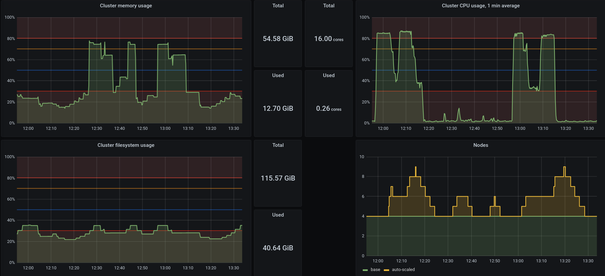
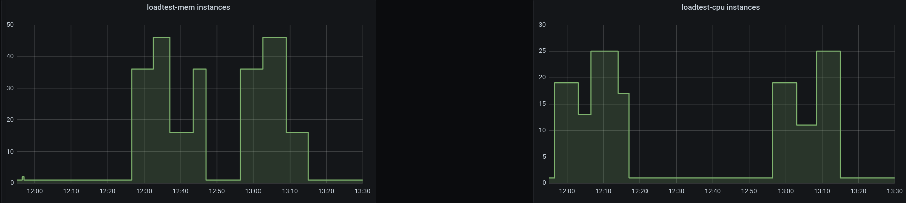

# Scale Kubernetes cluster
## Requirements
### Metrics
```
cluster-memory-usage = sum(container_memory_working_set_bytes{id="/",kubernetes_io_hostname=~"kube-worker-.*"}) / sum(machine_memory_bytes{kubernetes_io_hostname=~"kube-worker-.*"}) * 100
cluster-cpu-usage = sum(rate(container_cpu_usage_seconds_total{id="/",kubernetes_io_hostname=~"kube-worker-.*"}[1m])) / sum(machine_cpu_cores{kubernetes_io_hostname=~"kube-worker-.*"}) * 100
cluster-filesystem-usage = sum(container_fs_usage_bytes{device=~"^/dev/[sv]d[a-z][1-9]$",id="/",kubernetes_io_hostname=~"kube-worker-.*"}) / sum(container_fs_limit_bytes{device=~"^/dev/[sv]d[a-z][1-9]$",id="/",kubernetes_io_hostname=~"kube-worker-.*"}) * 100
```

### [kube-worker-quick-spawn](https://github.com/k8loud/kubernetes-lab-setup/tree/master/terraform/02_kube_worker_quick_spawn)
Preconfigured worker node image with the required dependencies.
`imageId` should be supplemented in the `scale-kubernetes-cluster-up` rule.


### mem-hoarder
It's used for memory stress testing and should be available on [DockerHub](https://hub.docker.com/r/k8loud/mem-hoarder) but if that's not the case run 
```
mem_hoarder\build_and_push.sh
```

## Description
Kubernetes cluster's load may differ depending on various factors.
One of the three cases will occur and eventually all of them will at some point in time:
- low resources, high demand - can't meet the requirements
- high resources, low demand - resources are wasted
- low resources, low demand / high resources, high demand - optimal

The last case is what we're aiming for, the problem is that it can't be achieved with a constant amount of worker nodes.
To address this issue we can dynamically adjust their count depending on the current cluster's state.
This scenario presents scaling based on CPU and RAM usage of the worker nodes.
Triggers of the rules include filesystem usage too, but it hasn't been tested.

Containers used:
- loadtest-cpu - takes up 1 CPU core
- loadtest-mem - takes up 1 GB of RAM

Stages of the scenario
| step | loadtest-cpu replicas | loadtest-mem replicas | duration [s] |
|------|-----------------------|-----------------------|--------------|
| 1    | 18                    | 0                     | 360          |
| 2    | 12                    | 0                     | 240          |
| 3    | 24                    | 0                     | 420          |
| 4    | 16                    | 0                     | 180          |
| 5    | 0                     | 0                     | 600          |
| 6    | 0                     | 35                    | 360          |
| 7    | 0                     | 45                    | 240          |
| 8    | 0                     | 15                    | 420          |
| 9    | 0                     | 35                    | 180          |
| 10   | 0                     | 0                     | 600          |
| 11   | 18                    | 35                    | 360          |
| 12   | 10                    | 45                    | 360          |
| 13   | 24                    | 15                    | 360          |

## Results
### Cluster

Horizontal lines on the graphs:
- red - values should bounce off of them, not crossing to the red areas
- yellow - threshold for scaling up
- blue - threshold for scaling down

### Loadtest


### Comment
#### One should keep in mind that all graphs should be contained in the area between red lines
Even if it's reasonable to scale based on one metric it may not be performed because of another.
Take `Cluster filesystem usage` as an example. It resides in the red area most of the time but it can't be scaled down because doing so would affect other metrics.

#### We maintain a minimum number of nodes which prevents scaling down
The initial load of all metrics reside in the bottom red area so during the reset phases (load-test replicas are 0) it seems that the cluster can be scaled down but it can't.

#### Scaling takes time
`Cluster CPU usage, 1 min average` presents this issue. During the flat peeks in the upper red area new nodes are being spawned. 
From the moment of triggering a scale up rule to being ready from the master node's point of view about 2-3 minutes pass.
Scaling down is quicker, it takes about 1-1.5 minutes from having a node in a cluster to VM being deleted.
