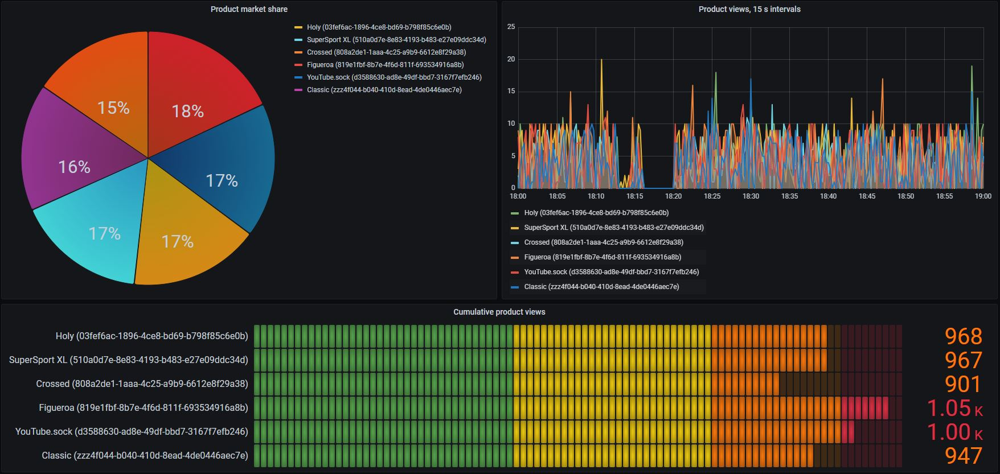
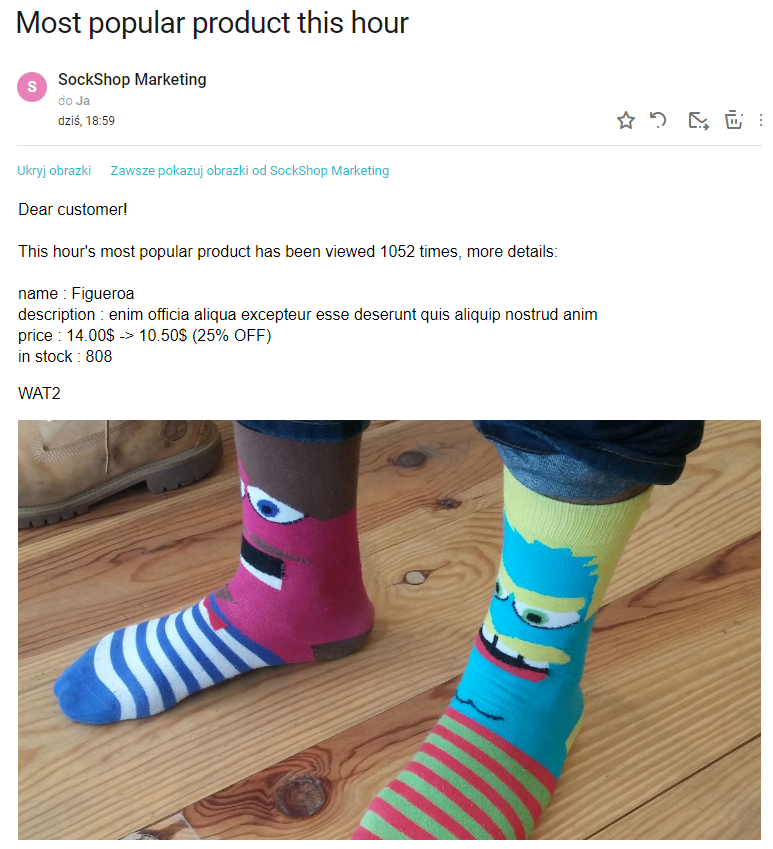
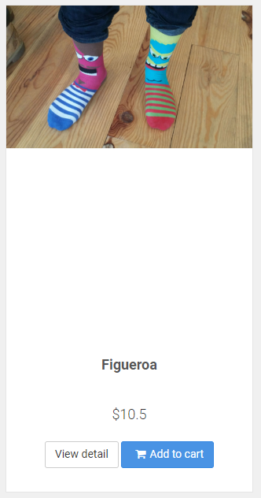

# SockShop notify customers
## Requirements
### Metrics
```
catalogue-queries-top1-1h = topk(1, round(increase(request_duration_seconds_count{job="kubernetes-service-endpoints", kubernetes_name="front-end", kubernetes_namespace="sock-shop", method="get", name="front-end", route=~"/catalogue/.*-.*-.*-.*-.*", service="front-end", status_code="200"}[1h])))
catalogue-db = kube_service_info{namespace="sock-shop", service="catalogue-db"}
```

## Description
SockShop management decided that in order to increase income an advertising campaign should be launched.
Each hour all customers will be sent a mail containing details about the most popular product in the company's catalogue.
The management is hoping that will cause a snowball effect (the more people buy the more others are convinced that the 
product is worth buying).
Some board members were not convinced that it'll be enough to bring the customers' attention.
After discussing for a while everyone agreed that the product should be discounted.

To achieve this goal the `catalogue-queries-top1-1h` metric has been created:
1. `request_duration_seconds_count{...}[1h]` - counts requests for items during last hour, grouped by itemId
2. `increase` - the query from 1. accumulates result, but we're interested in its growth
3. `round` - mitigates [the issues](https://stackoverflow.com/questions/70835778/understanding-increase-and-rate-used-on-http-server-requests-seconds-count-w) of `increase`
3. `topk(1, ...)` - selects the top 1 value

The metric is used in the `most-popular-this-hour` rule, which:
1. Awaits for the aforementioned metric
2. Checks the time constraint which will pass only once an hour
3. Gathers the required information and processes it
4. Submits a `MySqlUpdateAction` that updates the product's price
5. Submits a `NotifyCustomersAction`

## Results
SockShop management can observe products popularity trends on a Grafana dashboard


Customers received an e-mail


The price in the shop has been updated

