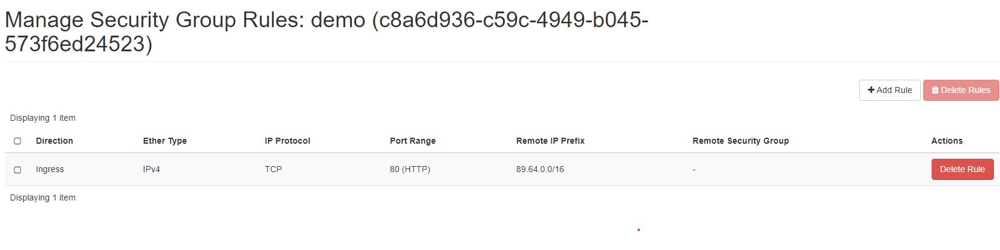
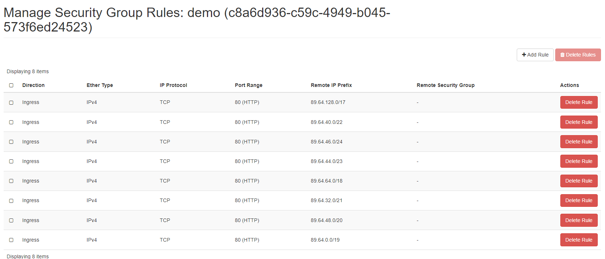
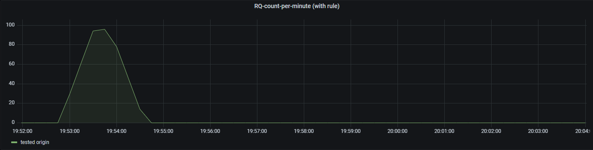
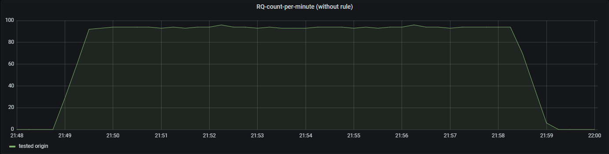

# Throttling
## Requirements

1. [Demo application](https://github.com/k8loud/demo-app) is deployed on node `kube-worker-0`
2. `demo_app_metric` is available in prometheus (should be OK if deployed from forked [microservices-demo](https://github.com/k8loud/microservices-demo))
3. [Simple flask app](https://github.com/k8loud/demo-app/blob/main/forward.py) is running on `kube-worker-0` with properly changed `target_url` (ClusterIP svc with demo-app)
4. Add security group rule that allows inbound http from your device (preferably with /16 mask)

## Description
In order to protect against DDOS attacks, we want to change security rules on our running instance
to disable income traffic from potential attacker. 
To achieve this goal, we have to monitor requests per origin
in given time period - that is why `demo-app-metric` was created. 

## Rule flow
1. Check if requests per origin is high (more than 90 requests in last minute)
2. Create security rules without subnet `<origin_ip>.0/24`
3. Delete current security rule that included origin IP
4. After given time, go back to previous configuration

## Results

### Security Rule changes

Before rule execution

After rule Execution

### Requests count

With added throttling rule

Without throttling rule
